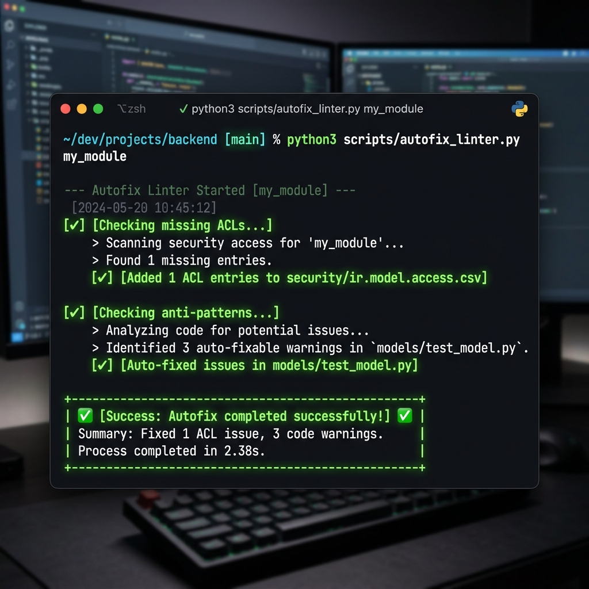

# odoo-dev-superskill

**Odoo Module Development Skill for AI Agents (16.0–19.0)**


[](https://skills.sh/CodeForUsers/odoo-dev-superskill)

A comprehensive AI agent skill providing scaffolding, refactoring tools, and architecture templates for Odoo module development. Enforces Odoo Community Association (OCA) coding standards and security guidelines across Odoo versions 16.0 through 19.0.

## Table of Contents
- [Features](#features)
- [Installation](#installation)
- [Repository Structure](#repository-structure)
- [Usage](#usage)
- [Behavior Templates](#behavior-templates)
- [Optional Agent Tooling](#optional-agent-tooling-codegraph--engram)
- [Key Version Differences](#key-version-differences)
- [Coverage & Limitations](#coverage--limitations)
- [Contributing](#contributing)
- [Author](#author)
- [License](#license)

## Features

- **Module Migration & Porting**: Automated version migrations and commit porting between branches using OCA tools (`oca-port` and `odoo-module-migrator`).
- **Module Scaffolding**: Command-line tools to generate complete, OCA-compliant Odoo modules.
- **Static Analysis & Refactoring**: Automated XML syntax upgrades (e.g., `attrs` to `invisible`) and anti-pattern detection.
- **Architecture Templates**: Boilerplates for OWL 2 components, POS offline architecture, B2B portals, and REST APIs.
- **Security & Performance**: Patterns for safe ORM bypassing (`cr.execute`), cache invalidation, and multi-company access rules.
- **E2E Testing**: Infrastructure templates for backend QUnit/Hoot testing and frontend Odoo Tours.
- **Behavior Templates**: Specialized agent behavior guides for scaffolding, migration, security, XML/UI, connectors, code review, and testing tasks.

## Installation

The skill is distributed via NPM for integration into local agent environments.

```bash
npx odoo-dev-superskill
```

This command copies the required references, scripts, and templates to the `.agents/skills/odoo-dev-superskill` directory in your current workspace.

### Prerequisites (for Migration Tools)

If you plan to use the automated version migration and porting scripts, install the required OCA tools directly from GitHub:

```bash
pip install git+https://github.com/OCA/oca-port.git
pip install git+https://github.com/OCA/odoo-module-migrator.git
```

## Repository Structure

```text
odoo-dev-superskill/
├── SKILL.md                          # Agent instructions and entry point
├── skill-manifest.json               # Skill capabilities manifest (JSON format)
├── references/                       # Technical architecture guides
│   ├── agents/                       # Behavior templates (loaded on demand)
│   │   ├── scaffold-behavior.md      # Module creation behavior
│   │   ├── migration-behavior.md     # Version migration behavior
│   │   ├── security-behavior.md      # Security & access control behavior
│   │   ├── xml-ui-behavior.md        # Views, XPath, OWL behavior
│   │   ├── connector-behavior.md     # API & integration behavior
│   │   ├── review-behavior.md        # Code review behavior
│   │   └── testing-behavior.md       # Testing & QA behavior
│   ├── images/                       # Screen and terminal mockups
│   │   └── terminal-mockup.png       # CLI execution mockup image
│   ├── backend-rules.md              # Python conventions, SQL security, and performance
│   ├── cheatsheet-agent.md           # Compact token-efficient agent cheatsheet
│   ├── ecommerce-connectors.md       # Patterns for E-commerce integrations
│   ├── error-recipes.json            # Machine-readable linter remediation recipes
│   ├── frontend-ui-rules.md          # XML views, OWL, and POS rules
│   ├── maturity-levels.md            # Addon maturity definitions
│   ├── migrations-and-versions.md    # Changelogs, version matrix, and OpenUpgrade guide
│   └── testing.md                    # Testing guidelines (TransactionCase/Hoot)
├── scripts/                          # CI/CD and automation tools
│   ├── auto_migrate_full.py          # Orchestrates full migration pipeline
│   ├── autofix_linter.py             # Automatically applies linter fixes to files
│   ├── autofix_xml.py                # Legacy XML refactoring
│   ├── check_acls.py                 # Verifies models have an ACL entry
│   ├── check_anti_patterns.py        # Detects common anti-patterns
│   ├── check_test_coverage.py        # Verifies test existence & coverage
│   ├── create_migration.py           # Creates OpenUpgrade migration folder
│   ├── detect_odoo_version.py        # Detects Odoo version
│   ├── extract_translations.py       # Extracts translatable strings
│   ├── migrate_code_patterns.py      # Code pattern migration (odoo-module-migrator)
│   ├── port_addon.py                 # Port commits between branches (oca-port)
│   ├── scaffold_module.py            # Module generator
│   ├── validate_manifest.py          # Manifest validation
│   └── validate_repo_consistency.py  # Repository internal reference validator
└── templates/                        # OCA-compliant code boilerplates
    ├── controller.py.tpl             # Controller templates
    ├── controllers/                  # Advanced API controllers (REST, OpenAPI)
    ├── data/                         # Initial and demo XML data
    ├── infra/                        # CI/CD, Docker and pre-commit configs
    ├── integrations/                 # Queue jobs templates
    ├── manifest/                     # Versioned manifest templates
    ├── migrations/                   # OpenUpgrade migration scripts
    ├── model_skeleton.py.tpl         # Standard model template
    ├── models/                       # Standard models and mixins
    ├── pos/                          # POS OWL component extensions
    ├── readme_structure/             # OCA README templates
    ├── reports/                      # QWeb PDF and XLSX report actions
    ├── scripts/                      # External RPC client scripts
    ├── security/                     # ir.model.access and Multi-company rules
    ├── static/                       # OWL 2 components and SCSS styles
    ├── tests/                        # Backend & Frontend test templates
    ├── views/                        # XML views (tree, list, kanban, pivot, etc.)
    ├── website/                      # Snippets & portal controllers
    └── wizard.py.tpl                 # Transient model template
```

## Usage



Once installed, standard AI coding agents (Claude Code, Cursor, Windsurf, Gemini) will automatically detect the `SKILL.md` file when operating in the workspace. The skill provides the agent with context regarding:
- Target Odoo versions and required syntax changes.
- Appropriate file structures for new modules.
- Linter and formatting rules.

To manually scaffold a module without an agent, execute the included script:

```bash
python scripts/scaffold_module.py \
    --name my_custom_module \
    --title "My Module" \
    --version 18.0 \
    --models my.custom.record \
    --output /path/to/addons/
```

To run a full Odoo module migration (code patterns + commit porting):

```bash
python scripts/auto_migrate_full.py \
    --source origin/16.0 \
    --target origin/18.0 \
    --module my_custom_module \
    --repo ./
```

## Behavior Templates

The skill includes specialized behavior templates that AI agents load on demand depending on the task at hand. These live in `references/agents/` and are automatically triggered from `SKILL.md`:

| Template | When it activates |
|---|---|
| `scaffold-behavior.md` | Creating a new addon or scaffolding from scratch |
| `migration-behavior.md` | Migrating between Odoo versions (deprecated syntax, ORM, assets) |
| `security-behavior.md` | ACLs, `ir.rule`, `sudo()`, controllers, raw SQL |
| `xml-ui-behavior.md` | XML views, XPath, QWeb, OWL, frontend assets |
| `connector-behavior.md` | APIs, marketplaces, webhooks, import/export pipelines |
| `review-behavior.md` | Code review, quality audit, OCA compliance |
| `testing-behavior.md` | Tests, coverage strategy, QA |

Templates can be combined when a task spans multiple areas (e.g., a migration that also changes XML views).

## Optional Agent Tooling (Codegraph & Engram)

If `codegraph` or `engram` servers are active in your local agent MCP environment, agents can optionally leverage them to enhance efficiency:
- **Codegraph (Optional)** ([colbymchenry/codegraph](https://github.com/colbymchenry/codegraph)): Speeds up codebase analysis by searching model inheritance, tracing method call paths, and resolving overloaded core definitions.
- **Engram (Optional)** ([Gentleman-Programming/engram](https://github.com/Gentleman-Programming/engram)): Automatically preserves local developer decisions, Odoo ORM bug resolution findings, and custom project-specific conventions between sessions.

## Key Version Differences

| Feature | 16.0 | 17.0 | 18.0 | 19.0 |
|---------|------|------|------|------|
| **List View Tag** | `<tree>` | `<tree>` | `<list>` * | `<list>` |
| **Conditional UI** | `attrs="{...}"` | `invisible="..."` | `invisible="..."` | `invisible="..."` |
| **ORM read_group** | `read_group()` | `read_group()` | `_read_group()` * | `_read_group()` |
| **Frontend Tests** | QUnit | QUnit | Hoot * | Hoot |
| **SQL Wrapper** | N/A | `SQL()` class | `SQL()` class | `SQL()` class |

*\* Indicates a breaking change introduced in this version.*

## Coverage & Limitations

The skill is optimized for development, migrations, and quality assurance of Odoo modules, but has specific limitations:
- **No Production SysAdmin / DevOps**: Does not manage PostgreSQL clustering, Docker container deployment in production, or cloud provisioning.
- **Complex Data Migrations**: Does not automate complex database data migration logic that requires custom business analysis.
- **Proprietary/Closed Integrations**: Cannot build connectors for proprietary platforms without public SDKs or API documentation.
- **Human Review**: Recommended modifications to existing business workflows must be manually verified.

## Contributing

We welcome contributions to expand our Odoo agent capabilities! To contribute:
1. **Adding Templates**: Place any new `.tpl` file inside the appropriate `templates/` subdirectory.
2. **Expanding References**: Technical guides must be placed in `references/` as markdown files.
3. **Updating the Skill**: Ensure all new files are cataloged in `SKILL.md` and `README.md`.
4. **Validation**: Always run the repository consistency validator before submitting a PR:
   ```bash
   python scripts/validate_repo_consistency.py
   ```

## Author
[David Carreres Gómez](https://github.com/CodeForUsers)

## License
This project is licensed under the MIT License. See the [LICENSE](LICENSE) file for details.
